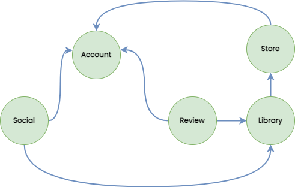

# Stim

This repository is just an example project to showcase DDD implementation in TS.

Stim is a gaming platform whose any resemblance to a similar platform is purely coincidental :-)

## Context Map

## Use Cases

List of **Use Cases** for each **Bounded Context**:

- **Account:**
    - Publisher can RegisterPublisher / UpdatePublisher
    - Developer can RegisterDeveloper / UpdateDeveloper
    - Gamer can RegisterGamer / UpdateGamer
- **Store**
    - Publisher can PublishGame
    - Gamer can AddCredits / PurchaseGame
- **Library**
    - Gamer can SeeGames / LaunchGame / CloseGame
- **Review**
    - Anyone can SeeReviews
    - Gamer can AddReview
- **Social:**
    - Gamer can SeeFriends / AddFriend / BlockFriend
    - Gamer can UpdateStatus
    - Gamer can SendMessageToFriend

## User Stories

I created a [Trello Board](https://trello.com/b/U3TrmGSg/stim) with tickets representing User Stories assigned to a specific Bounded Context and commit.
